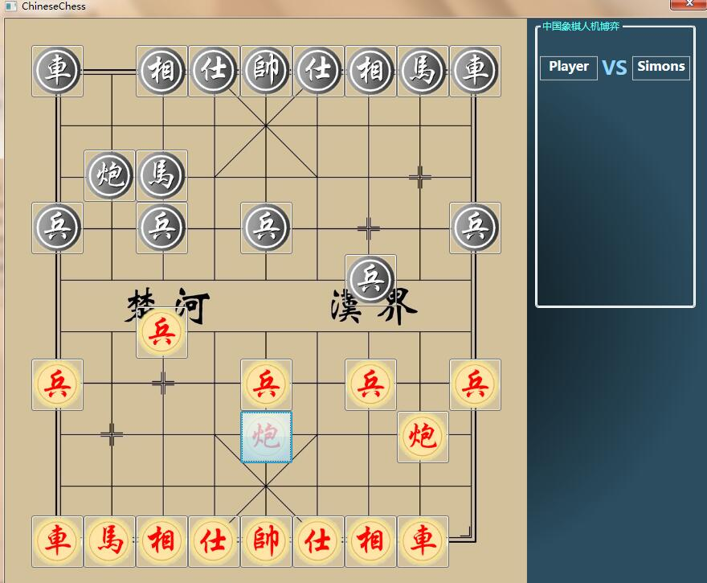

# ChineseChessGame
This is an online game contains game lobby, game platform and chat interface. I developed this game using .NET Framework developed the frame, game platform and client-server model. The programming language used was C#. People can go to game lobby to choose seat and then play the Chinese Chess game with each other.

	This is a version of ChineseChessGame.A Human-Battle Game 
:blush:

	This game mainly divided into three parts,including Interface section,Rule section,Engine section.Engine secion use Appha-Beta -Hastable tree to assess the situation.

